# FurTwin 用户使用指南

欢迎使用 FurTwin！这是一款可爱的桌面宠物软件，让你的宠物在桌面上陪伴你。

---

## 目录

1. [简介](#简介)
2. [安装与启动](#安装与启动)
3. [退出程序](#退出程序)
4. [系统托盘菜单](#系统托盘菜单)
5. [控制面板](#控制面板)
6. [动作库](#动作库)
7. [提示词生成器](#提示词生成器)
8. [提取视频](#提取视频)
9. [批量导入动作包](#批量导入动作包)
10. [导出动作包](#导出动作包)
11. [切换动作](#切换动作)
12. [自动行为](#自动行为)
13. [点击触发](#点击触发)
14. [隐身模式与鼠标穿透](#隐身模式与鼠标穿透)
15. [开机自启](#开机自启)
16. [恢复内置预览](#恢复内置预览)
17. [常见注意事项](#常见注意事项)
18. [常见问题排查](#常见问题排查)
19. [反馈与支持](#反馈与支持)

---

## 简介

FurTwin 是一款 Windows 桌面宠物软件，支持导入自定义宠物动画，让你的宠物在桌面上自由活动。

**主要功能：**
- 导入自定义宠物动画（支持批量导入）
- 自动行为：宠物会自动切换动作
- 隐身模式与鼠标穿透：宠物透明时不影响操作
- 提示词生成器：帮助你生成 AI 视频提示词
- 开机自启：让宠物随系统启动

---

## 安装与启动

### 安装版（推荐）

1. 下载 `FurTwin-版本号-setup.exe`
2. 双击运行，按照安装向导操作
3. 可以选择安装目录
4. 安装完成后，可以从开始菜单、桌面快捷方式或安装目录启动 FurTwin

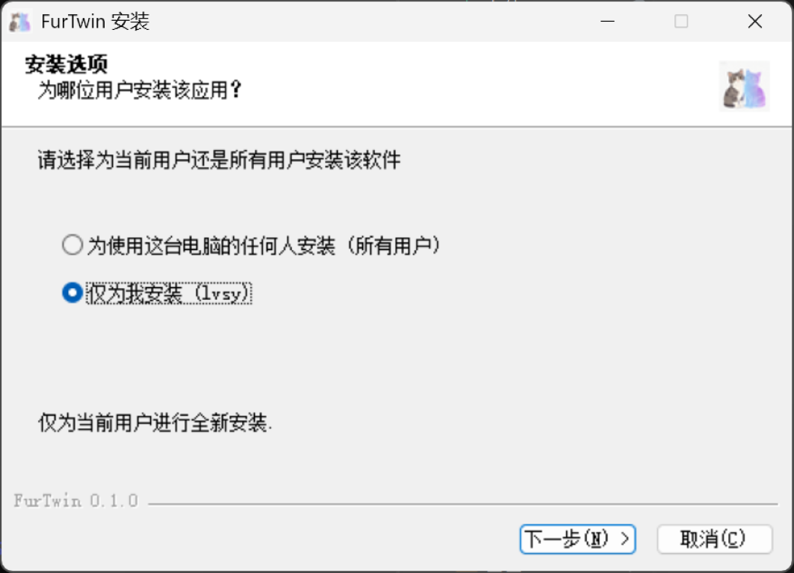

### 免安装版

1. 下载 `FurTwin-版本号-win-unpacked.zip`
2. 解压到任意目录
3. 运行 `furtwin.exe`

**区别：**

| 特性 | 安装版 | 免安装版 |
|------|--------|----------|
| 安装向导 | ✅ 有 | ❌ 无 |
| 选择安装目录 | ✅ 支持 | - |
| 开始菜单快捷方式 | ✅ 自动创建 | ❌ 无 |
| 卸载程序 | ✅ 有 | ❌ 手动删除 |
| 便携性 | ❌ 固定安装 | ✅ 随处运行 |

---

## 退出程序

有以下方式退出 FurTwin：

1. **右键宠物** → 选择"退出"
2. **右键托盘图标** → 选择"退出"

退出后，宠物位置会自动记忆，下次启动时恢复到上次位置。

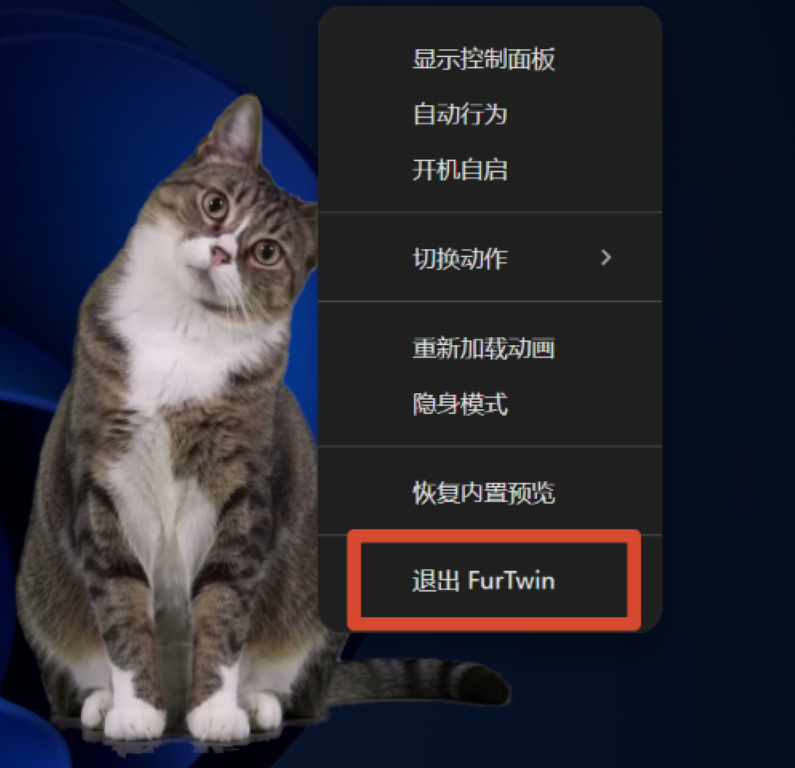

---

## 系统托盘菜单

FurTwin 启动后会在系统托盘（任务栏右下角）显示图标。

### 左键点击

- 打开/关闭控制面板

### 右键点击

弹出菜单，包含：

- **显示控制面板** — 打开控制面板
- **自动行为** — 开启/关闭自动行为
- **开机自启** — 开启/关闭开机自启
- **切换动作** — 快速切换宠物动作
- **重新加载动画** — 重新加载当前动作资源
- **隐身模式** — 开启/关闭隐身模式
- **恢复内置预览** — 使宠物恢复内置宠物动作
- **找回桌宠** — 桌宠被遮挡、隐藏或隐身时，恢复可见并重新置顶
- **退出FurTwin** — 退出程序
- **FurTwin v0.1.4** — 显示当前版本号（不可点击）

鼠标悬停在托盘图标上也会显示版本号。

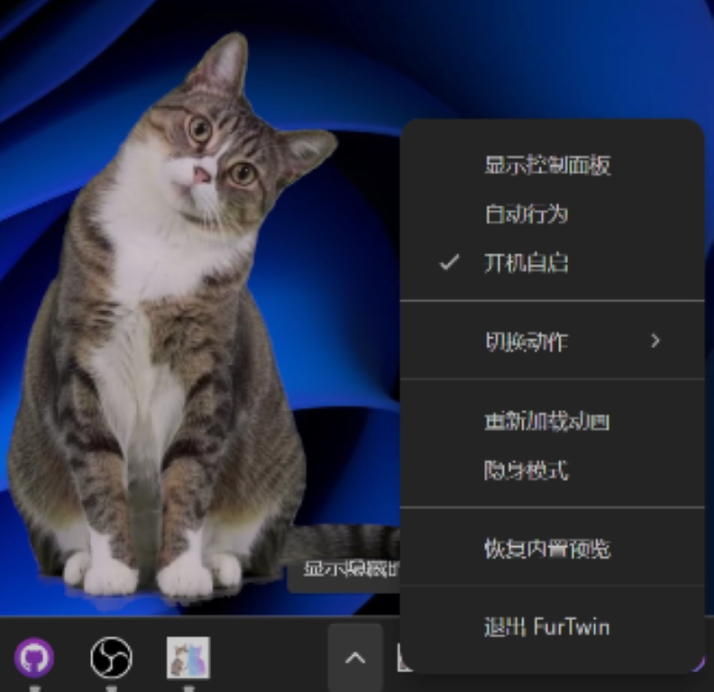

---

## 控制面板

控制面板是管理宠物的核心界面。标题下方会显示当前版本号（如 `v0.1.4`），方便确认安装的版本。

### 退出应用

控制面板标题栏右侧提供了「退出 FurTwin」按钮，可直接退出应用程序。此按钮与关闭控制面板窗口（仅隐藏）含义不同，点击后会完整退出应用。

### 诊断

行为与模式标签页底部提供了诊断区，包含以下入口：

- **打开日志目录** — 打开 `%APPDATA%\Furtwin\logs` 目录
- **打开配置目录** — 打开 `%APPDATA%\Furtwin` 目录
- **查看最近日志** — 展开后可查看主进程日志（`furtwin-main.log`）的末尾内容，支持手动刷新与收起

控制面板包含以下标签页：

| Tab | 功能 |
|-----|------|
| **动作库** | 查看和管理所有已导入的动作 |
| **行为与模式** | 配置自动行为、隐身模式 |
| **获取视频** | 使用提示词生成器生成 AI 视频提示词 |
| **提取视频** | 将绿幕视频提取为透明序列帧 |

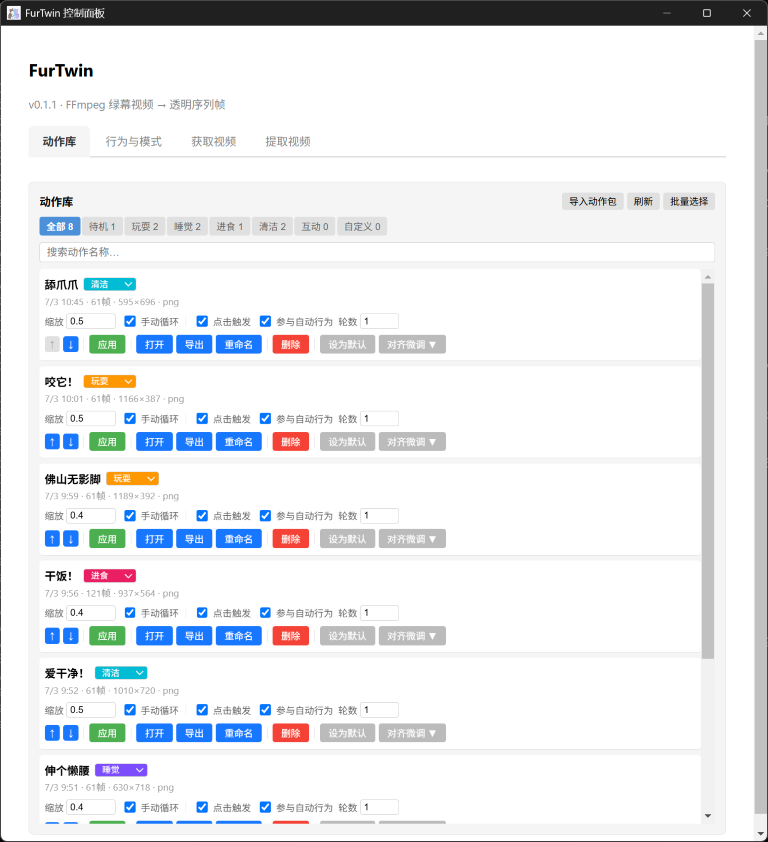

---

## 动作库

动作库显示所有已导入的宠物动作，是管理宠物动画的核心界面。

每个动作卡片显示：
- 动作名称
- 帧数、分辨率、格式
- 动作类型（待机/行走/奔跑/玩耍/睡觉/自定义）
- 当前使用状态（绿色标记"当前使用"）
- 是否为默认动作（橙色标记"默认"）

### 操作按钮

| 按钮 | 说明 |
|------|------|
| **应用** | 将此动作设为当前使用动作，并立即播放 |
| **打开** | 打开动作资源所在文件夹，方便查看或手动管理文件 |
| **导出** | 将此动作为 zip 包，便于备份或分享给其他用户 |
| **重命名** | 修改动作在动作库中的显示名称 |
| **删除** | 删除此动作资源；若正在使用，会自动切换到其他可用动作 |
| **设为默认** | 将此动作设为默认 fallback 动作；当前动作失效时会优先使用 |
| **取消默认** | 取消此动作的默认状态 |

### 动作设置

每个动作卡片还包含以下设置项：

| 设置 | 说明 |
|------|------|
| **缩放** | 调整宠物在桌面上的显示大小（范围 0.1-2.0） |
| **手动循环** | 手动点击"应用"使用此动作时，是否持续循环播放 |
| **点击触发** | 开启后，左键点击桌宠时会播放此动作；适合配置"摸头"、"互动"等动作 |
| **参与自动行为** | 开启后，此动作可被自动行为系统随机选中播放 |
| **自动轮数** | 自动行为播放此动作时循环几轮（仅在"参与自动行为"或"点击触发"开启时生效） |
| **动作类型** | 设置动作类型标签，用于动作库整理和分类筛选 |

### 对齐微调

如果源视频有对齐数据，可以微调动作的水平/垂直偏移，用于修正不同动作切换时的视觉偏移。

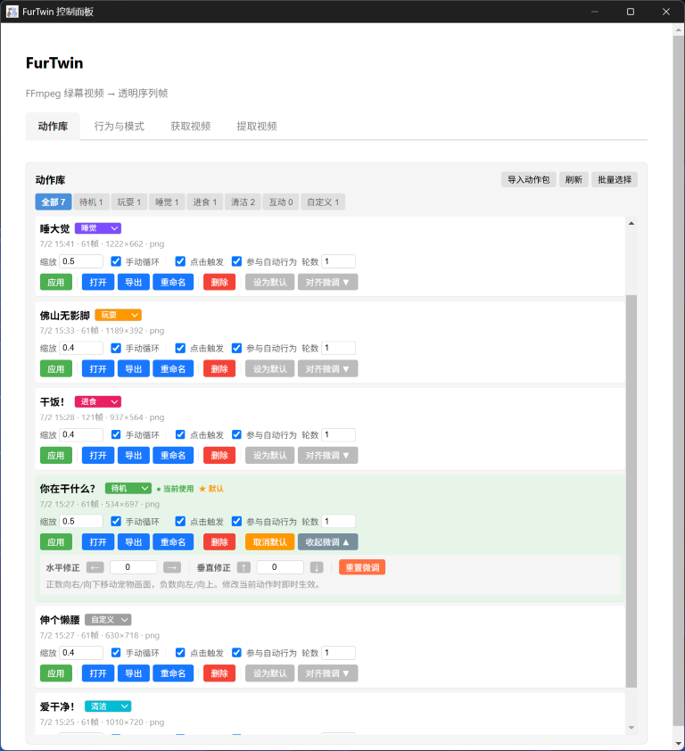

### 批量选择模式

点击动作库右上角的「批量选择」按钮，可进入批量选择模式，方便一次管理多个动作。

**基本操作：**
- **勾选动作** — 每个动作卡片左侧显示 checkbox，点击勾选
- **全选** — 选中当前筛选条件下的所有动作
- **取消选择** — 清空所有选择
- **退出批量选择** — 退出批量模式，恢复普通显示

**批量删除：**
- 未选择动作时，「批量删除」按钮不可用
- 选择动作后点击「批量删除」，会弹出二次确认
- 确认后删除选中动作，动作库自动刷新并退出批量模式
- 若删除包含当前正在播放的动作，会自动切换到其他可用动作

**批量导出：**
- 选择动作后点击「批量导出」，可将选中的多个动作导出为一个 zip 动作包
- 导出的 zip 可以通过「导入动作包」重新导入
- 适合备份、迁移或分享多个动作

**体验细节：**
- 隐藏控制面板后再次打开，会自动退出批量选择模式并清空选择，避免误操作

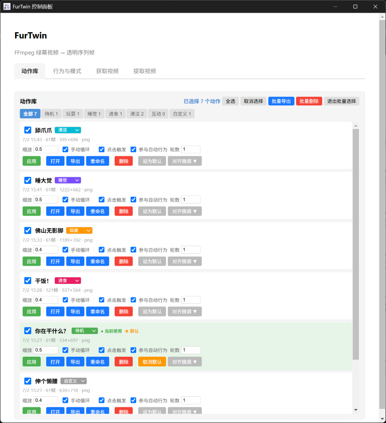

### 名称搜索

在类型 tab 下方有搜索输入框，可以按动作名称快速筛选。

- 搜索在当前类型 tab 的结果内生效。例如在"全部"tab 搜索会在所有动作中匹配，在"清洁"tab 搜索只匹配清洁类型的动作。
- 搜索不区分大小写。
- 清空搜索框后恢复当前类型 tab 的完整列表。
- 搜索兼容批量选择模式：搜索不会清空已选中的动作，「全选」只作用于当前可见的搜索结果。

### 手动排序

在"全部"tab、搜索框为空、非批量选择模式下，每个动作卡片会显示「↑」和「↓」排序按钮，可以手动调整动作的排列顺序。

- 点击「↑」将动作上移一位，点击「↓」将动作下移一位。
- 第一个动作不能上移，最后一个动作不能下移（按钮会显示为禁用状态）。
- 排序结果会自动持久保存，关闭重开程序后顺序仍然保持。
- 新导入或新提取的动作默认追加到列表末尾。
- 删除动作不会影响其他动作的排序位置。
- 右键菜单的动作列表也会跟随排序后的顺序。

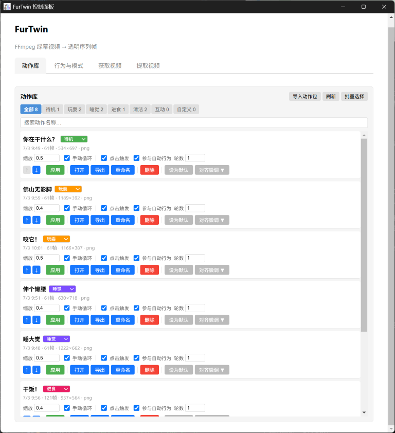

---

## 提示词生成器

提示词生成器帮助你生成 AI 视频提示词，用于生成宠物动画。

### 功能特点

- 预设模板：提供多种动作预设（idle、walk、run 等）
- 自定义动作：输入你想要的动作描述
- 参数配置：视频比例、时长、镜头固定等
- 一键复制：生成后直接复制到剪贴板

### 使用步骤

1. 在控制面板 → 获取视频
2. 选择预设类别和动作，或输入自定义动作描述
3. 配置参数（比例、时长等）
4. 点击"生成提示词"
5. 复制提示词，粘贴到 AI 视频生成工具

> **💡 重要建议：** 复制提示词到豆包网页端 / App 前，建议先上传宠物的**正面全身照**，尽量保证宠物完整入镜、无遮挡，再粘贴提示词生成视频。这样更容易生成完整、稳定、适合循环播放的绿幕动作视频。

### 照片建议

- **正面** — 宠物面向镜头，不要侧面或背面
- **全身** — 包括尾巴、耳朵、四肢都要完整可见
- **完整入镜** — 宠物主体不要被裁切
- **无遮挡** — 避免被其他物体或背景遮挡

### 预设类别

- **idle** — 待机动作（站立、坐着、躺着等）
- **walk** — 行走动作
- **run** — 奔跑动作
- **play** — 玩耍动作
- **sleep** — 睡觉动作
- **custom** — 自定义动作

### 自定义动作

在"自定义动作描述"输入框中，输入你想要的动作，例如：
- "让它面向镜头侧躺抱着逗猫玩具用两只后脚蹬着玩"
- "让它原地转圈追自己的尾巴"
- "让它用爪子洗脸"

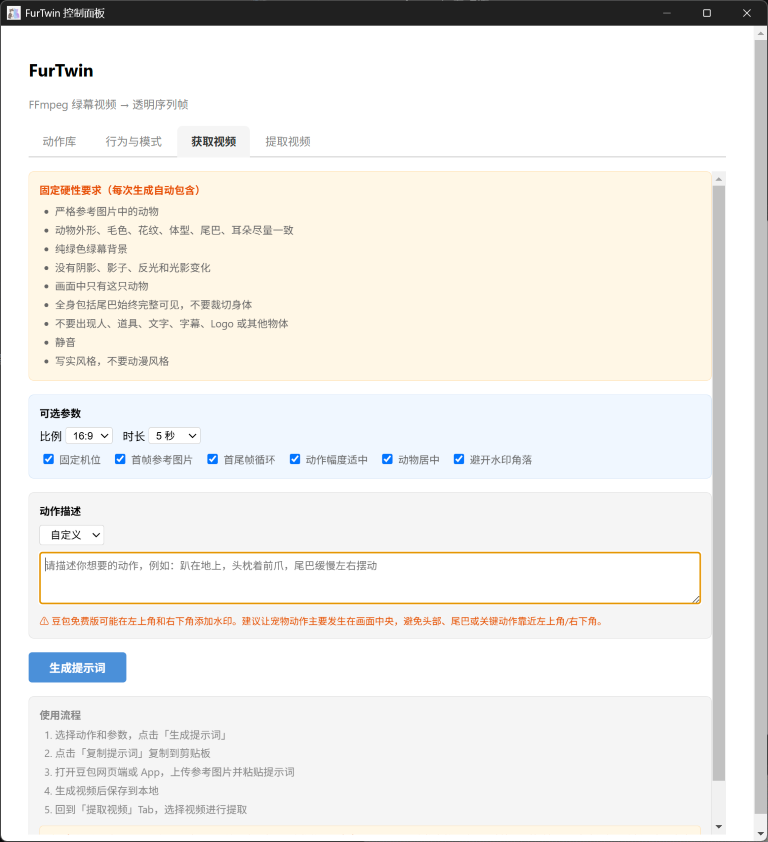

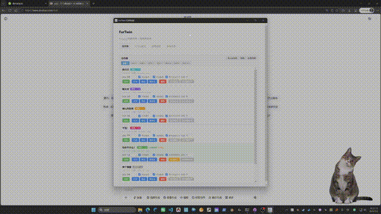

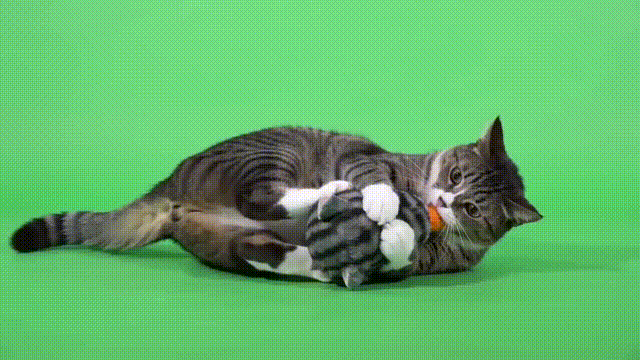

---

## 提取视频

提取视频功能用于从绿幕视频中提取透明序列帧，生成宠物动作。

### 基本流程

1. 在控制面板 → 提取视频
2. 选择绿幕视频文件（支持 mp4、mov、avi、mkv）
3. 调整提取参数（一般默认即可）
4. 点击"开始提取"
5. 等待提取完成
6. 预览提取结果
7. 确认加入动作库或丢弃重新提取

### 提取参数

| 参数 | 说明 | 建议 |
|------|------|------|
| **FPS** | 提取帧率，越高动画越流畅，但文件更多 | 默认 12，一般够用 |
| **Similarity** | 绿幕颜色匹配范围，影响扣绿范围 | 默认 0.30 |
| **Blend** | 边缘混合强度，数值越大边缘越柔和 | 默认 0.05 |
| **Despill** | 绿色溢色去除强度 | 默认 0.95 |
| **输出格式** | 导出的透明帧格式 | PNG 或 WebP |

### 透明边界裁剪

- **裁剪透明** — 自动裁剪透明边缘，推荐开启
- **裁剪边距** — 裁剪后保留的边距像素
- **裁剪阈值** — 判定为透明的 alpha 阈值

### 提取后操作

| 操作 | 说明 |
|------|------|
| **预览** | 查看提取结果在桌面上的效果 |
| **确认** | 将提取结果加入动作库 |
| **丢弃** | 丢弃当前提取结果 |
| **重新提取** | 丢弃当前结果，但保留视频路径和参数，方便调整参数后重新提取 |

### 注意事项

- 首次播放提取的动作时需要计算 shape-cache（形状缓存），可能出现轻微卡顿，属于正常现象
- 提取完成后，动作会自动进入动作库，可以在动作库中进行后续管理
- 如果提取效果不理想，可以调整参数后重新提取

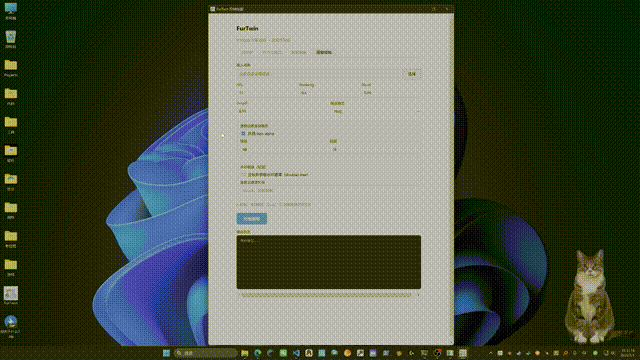

---

## 批量导入动作包

支持导入动作包，提供三种导入方式：

### 导入方式

1. **导入单个动作 zip** — 选择一个动作包文件导入
2. **批量导入多个 zip** — 在文件选择窗口一次选中多个 zip 文件批量导入
3. **导入批量导出包** — 导入「批量导出」生成的单个多动作 zip 包

### 导入步骤

1. 在控制面板中点击"导入动作包"
2. 在文件选择窗口中选择一个或多个 zip 文件
3. 等待导入完成
4. 导入完成后动作库会自动刷新显示

### 支持的动作包类型

**单动作包：**
- zip 根目录包含 `asset-metadata.json` 和序列帧
- 导入后直接加入动作库

```
某个动作.zip
├── asset-metadata.json    # 动作元数据
├── 0001.png               # 序列帧
├── 0002.png
├── 0003.png
└── ...
```

**批量导出包：**
- zip 内包含多个一级子目录，每个子目录对应一个动作
- 每个子目录包含自己的 `asset-metadata.json` 和序列帧
- 导入后程序会自动识别子目录并逐个加入动作库

```
批量导出.zip
├── 动作A_abc123/
│   ├── asset-metadata.json
│   └── *.png
├── 动作B_def456/
│   ├── asset-metadata.json
│   └── *.png
└── ...
```

**说明：**
- `asset-metadata.json` 是必需的元数据文件
- 帧文件支持 `.png` 和 `.webp` 格式
- 导入失败的动作不会影响其他动作的导入

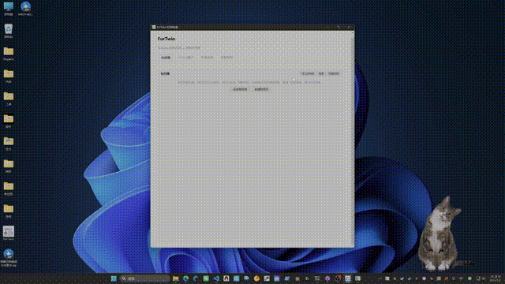

---

## 导出动作包

支持单动作导出和批量导出，方便备份、迁移或分享动作。

### 单动作导出

1. 在动作库中找到要导出的动作
2. 点击动作卡片上的「导出」按钮
3. 选择保存位置
4. 等待导出完成

导出的是一个单动作 zip 包，包含该动作的元数据和序列帧。

### 批量导出

1. 在动作库点击「批量选择」进入批量选择模式
2. 勾选要导出的多个动作
3. 点击「批量导出」按钮
4. 选择保存位置
5. 等待导出完成

程序会把选中的多个动作导出为一个 zip 包，每个动作作为独立的子目录。该 zip 可以通过「导入动作包」重新导入，适合备份、迁移或分享多个动作。

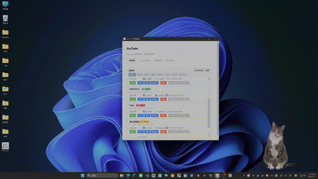

---

## 切换动作

有多种方式切换宠物动作：

1. **动作库点击** — 在控制面板中点击动作卡片
2. **托盘菜单** — 右键托盘 → 切换动作
3. **宠物右键菜单** — 右键宠物 → 切换动作
4. **自动行为** — 程序自动切换（见下节）
5. **点击触发** — 点击宠物触发特定动作（见下节）

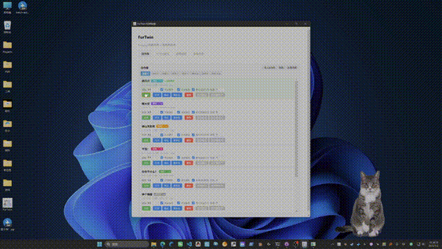

---

## 自动行为

自动行为让宠物自动切换动作，保持活力。

### 开启/关闭

在控制面板 → 行为与模式 → 自动行为开关

### 参数设置

- **首次延迟** — 启动后多久开始第一次自动切换（默认 30 秒）
- **最小间隔** — 两次自动切换的最短间隔（默认 60 秒）
- **最大间隔** — 两次自动切换的最长间隔（默认 120 秒）
- **手动切换后暂停** — 手动切换动作后，暂停自动切换的时长（默认 120 秒）

### 行为逻辑

1. 程序启动后，等待"首次延迟"时间
2. 随机选择一个参与轮播的动作
3. 切换后，等待"最小间隔"到"最大间隔"之间的随机时间
4. 重复步骤 2-3
5. 如果手动切换了动作，暂停"手动切换后暂停"时长

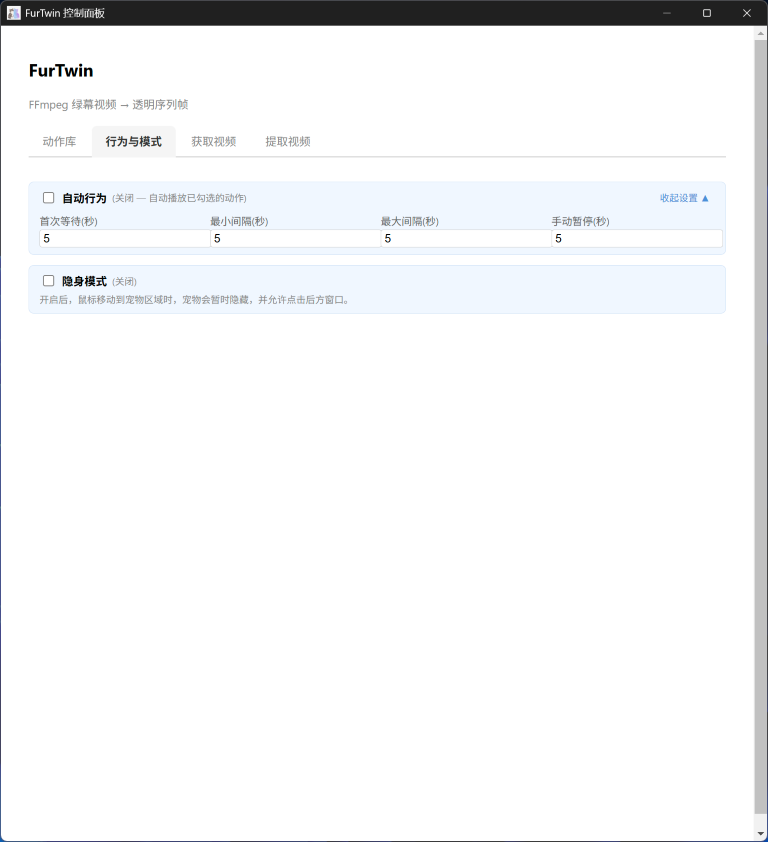

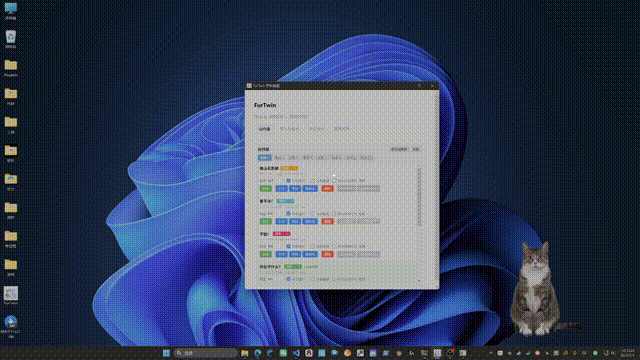

---

## 点击触发

部分动作支持点击触发，点击宠物即可播放。

### 配置

在动作的设置中，可以开启/关闭"点击触发"功能。

### 行为

- 点击宠物 → 播放该动作
- 动作播放完成后 → 恢复之前的动作

适合配置"摸头"、"互动"等动作。


---

## 隐身模式与鼠标穿透

### 工作原理

开启隐身模式后：
- 鼠标移动到宠物区域时，宠物会自动隐藏
- 鼠标移开后，宠物恢复显示
- 鼠标点击可以穿透到后方窗口

**使用场景：**
- 宠物在工作区域时，不想被遮挡
- 想让宠物"隐形"陪伴，但不影响工作
- 全屏游戏/应用时，宠物不会干扰操作

### 开启方式

1. 托盘右键菜单 → 隐身模式
2. 控制面板 → 行为与模式 → 隐身模式开关
3. 宠物右键菜单 → 隐身模式

### 安全出口

Tray 菜单是关闭隐身模式的安全出口，即使宠物隐藏了也能通过托盘菜单关闭。

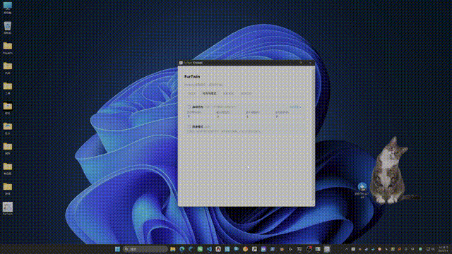

---

## 开机自启

让 FurTwin 随 Windows 系统自动启动。

### 开启/关闭

1. 托盘右键菜单 → 开机自启
2. 宠物右键菜单 → 开机自启

### 注意事项

- 开机自启可能受 Windows 权限影响
- 部分安全软件可能阻止开机自启
- 如果不生效，请以管理员身份运行一次 FurTwin

---

## 恢复内置预览

如果内置预览动作异常、被误删，或当前动作资源异常，可以使用"恢复内置预览"功能。

### 恢复方法

1. 托盘右键菜单 → 恢复内置预览
2. 宠物右键菜单 → 恢复内置预览

恢复后，动作库中会重新出现内置的 idle 预览动作。

---

## 常见注意事项

### 1. 首次运行卡顿

动作首次运行时需要计算 shape-cache（形状缓存），可能会有轻微卡顿。

**说明：** 这是正常现象，后续运行会流畅。

### 2. 大量动作切换慢

导入大量动作后，首次切换可能稍慢。

**说明：** 动作资源会在后台加载，后续切换会更快。

### 3. 隐身模式点击穿透

隐身模式开启后，鼠标点击会穿透宠物，直接点击背后的窗口。

**说明：** 这是设计行为，方便你在宠物背后操作窗口。

### 4. 动作资源丢失

如果动作资源被外部删除（如手动删除文件），程序会自动 fallback 到默认动作。

**说明：** 不会崩溃，但需要重新导入该动作。

### 5. 开机自启不生效

开机自启可能受 Windows 权限或安全软件影响。

**解决：** 以管理员身份运行一次 FurTwin，或检查安全软件设置。

---

## 常见问题排查

### Q: FurTwin 启动后没有显示宠物

**可能原因：**
1. 宠物位置在屏幕外（多显示器切换后）
2. 宠物被其他窗口遮挡
3. 隐身模式已开启

**解决方法：**
1. 右键托盘图标 → 显示控制面板
2. 检查是否开启隐身模式，如已开启先关闭
3. 通过托盘菜单切换动作或重新加载动画
4. 重启 FurTwin

### Q: 托盘图标不显示

**可能原因：**
1. Windows 托盘设置中隐藏了图标
2. 程序启动异常

**解决方法：**
1. 检查 Windows 任务栏设置 → 选择哪些图标显示在任务栏上
2. 重启 FurTwin

### Q: 导入动作包失败

**可能原因：**
1. zip 文件格式不正确
2. 动作包内缺少 `asset-metadata.json`
3. 文件路径过长

**解决方法：**
1. 检查 zip 文件是否完整
2. 确认动作包结构正确（单动作包需在根目录包含 `asset-metadata.json`，批量包需在子目录中包含）
3. 尝试解压到更短的路径

### Q: 动作播放不流畅

**可能原因：**
1. 帧率设置过高
2. 分辨率过高
3. 系统资源不足

**解决方法：**
1. 降低帧率（如 12fps）
2. 降低分辨率
3. 关闭其他占用资源的程序

### Q: 隐身模式不生效

**可能原因：**
1. Windows 版本不支持
2. 显卡驱动问题

**解决方法：**
1. 确认 Windows 10/11
2. 更新显卡驱动
3. 重启 FurTwin

### Q: 开机自启不生效

**可能原因：**
1. Windows 权限限制
2. 安全软件阻止

**解决方法：**
1. 以管理员身份运行一次 FurTwin
2. 检查安全软件设置
3. 手动添加启动项

### Q: 桌宠不见了 / 被遮挡 / 隐身了

**可能原因：**
1. 桌宠被其他窗口遮挡（失去置顶）
2. 桌宠被最小化或隐藏
3. 隐身模式已开启

**解决方法：**
右键系统托盘图标 → 「找回桌宠」，桌宠会恢复可见并重新置顶。
如果仍无法恢复，可尝试重启 FurTwin。

### Q: 反馈问题时如何提供更多信息

FurTwin 主进程会记录运行日志，反馈问题时请一并提供日志文件，便于快速定位：

- 日志路径：`%APPDATA%\FurTwin\logs\furtwin-main.log`
- 打开 `%APPDATA%\FurTwin\logs\` 目录即可找到

请提供问题发生时间点附近的日志片段（如可能）。

---

## 反馈与支持

如有问题或建议，请通过以下方式反馈：

- GitHub Issues: [项目地址](https://github.com/LeonEleven/FurTwin/issues)
- 邮箱: [elevenlianm@foxmail.com](mailto:elevenlianm@foxmail.com)

---

*最后更新：2026-07-07*
